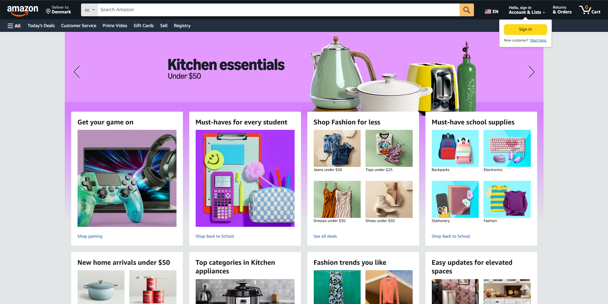
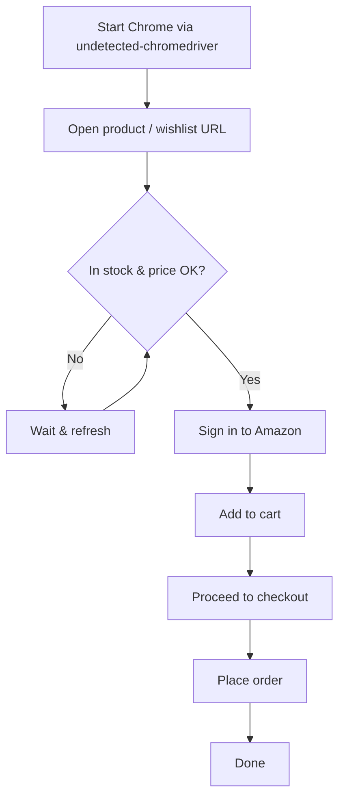

<div align="center">

  

  <br /><br />

  

  # Amazon Auto Checkout

  **Monitor Amazon product availability and price — then checkout automatically when your conditions are met.**

  <br />

  [](https://www.python.org/downloads/)
  [](https://www.selenium.dev/)
  [](https://www.google.com/chrome/)
  [](./LICENSE)
  [](https://github.com/aster-god/Amazon-ACO)

  <br />

  [Features](#features) •
  [How It Works](#how-it-works) •
  [Requirements](#requirements) •
  [Installation](#installation) •
  [Configuration](#configuration) •
  [Usage](#usage) •
  [Disclaimer](#disclaimer)

</div>

---

## Overview

Amazon Auto Checkout is a Python automation tool that watches an Amazon product page (or wishlist) and completes a purchase when:

- the item is **in stock**
- the price is **at or below your configured maximum**
- your Amazon account can sign in successfully

It uses **Selenium** with **undetected-chromedriver** to drive Chrome, rotate user agents, and navigate Amazon's checkout flow with minimal manual intervention.

> **Example use case:** automatically buying a high-demand item (e.g. a PS5) the moment it becomes available within your budget.

---

## Features

| Feature | Description |
| --- | --- |
| **Stock monitoring** | Continuously refreshes the product page until the item is available |
| **Price guard** | Skips checkout if the listed price exceeds `MAX_PRICE` |
| **Auto sign-in** | Logs into Amazon using credentials from your `.env` file |
| **One-click checkout** | Adds the item to cart and places the order with your default payment & shipping |
| **Wishlist mode** | Monitors a wishlist URL and checks out the first in-stock, in-budget item |
| **User-agent rotation** | Switches browser identity periodically to reduce detection |
| **Captcha awareness** | Basic handling for common Amazon captcha prompts (limited) |

---

## How It Works



1. Launches an undetected Chrome session.
2. Polls the target URL until stock and price conditions are satisfied.
3. Signs in with your Amazon credentials.
4. Adds the item to cart and completes checkout using your account defaults.

---

## Requirements

| Requirement | Notes |
| --- | --- |
| [Python 3.9+](https://www.python.org/downloads/) | Tested with Python 3.9 |
| [Google Chrome](https://www.google.com/chrome/) | Must match your installed Chrome version |
| [ChromeDriver](https://chromedriver.chromium.org/downloads) | Place the matching driver in the project directory |
| Dependencies in `requirements.txt` | Installed via pip (see below) |

---

## Installation

**1. Clone the repository**

```bash
git clone https://github.com/aster-god/Amazon-ACO.git
cd Amazon-ACO
```

**2. Install Python dependencies**

```bash
py -m pip install -r requirements.txt
```

**3. Install ChromeDriver**

Download the [ChromeDriver](https://chromedriver.chromium.org/downloads) build that matches your Chrome version and place it in the project root.

---

## Configuration

Copy the sample environment file and fill in your values:

```bash
cp .env.sample .env
```

### Environment variables

| Variable | Description | Example |
| --- | --- | --- |
| `MAIL` | Amazon account email | `you@example.com` |
| `PASSWORD` | Amazon account password | `your-password` |
| `ITEM_URL` | Product or wishlist URL to monitor | `https://www.amazon.com/dp/B0...` |
| `SHOP_URL` | Amazon storefront base URL | `https://www.amazon.com/` |
| `CART_URL` | Cart page URL for your region | `https://www.amazon.com/gp/cart/view.html` |
| `MAX_PRICE` | Maximum acceptable price (numeric) | `500` |
| `MIN_DELAY` | Minimum seconds between refresh attempts | `2` |
| `MAX_DELAY` | Maximum seconds between refresh attempts | `4` |
| `RUNS_BEFORE_AGENT_SWITCH` | Refreshes before rotating user agent | `100` |

> Use the Amazon domain that matches your account (`.com`, `.de`, `.co.uk`, etc.) in `SHOP_URL`, `CART_URL`, and `ITEM_URL`.

---

## Usage

```bash
py main.py
```

The script runs until it successfully places an order or you stop it with `Ctrl+C`.

---

## Before You Run

Please review these common edge cases:

- **Two-factor authentication (2FA)** — the bot may fail to sign in if 2FA is enabled. Disabling 2FA reduces account security and is **not recommended**.
- **Empty cart** — start with an empty Amazon shopping cart to avoid accidental multi-item orders.
- **Default payment & address** — checkout uses your account's saved shipping address and payment method. Verify both are correct before running.
- **Regional storefronts** — selectors and page layout can differ between Amazon locales; test with your target domain.
- **Terms of service** — automated purchasing may violate Amazon's terms. **Use at your own risk.**

---

## Project Structure

```
Amazon-Auto-Checkout/
├── main.py           # Entry point — monitoring loop & checkout orchestration
├── functions.py      # Login, stock checks, cart, and order placement
├── browser.py        # Chrome driver setup and DOM helpers
├── requirements.txt  # Python dependencies
├── .env.sample       # Environment variable template
└── assets/           # README branding images
```

---

## Disclaimer

This project is provided **as-is**, without warranty of any kind. Automated checkout tools carry inherent risk:

- Failed orders, duplicate charges, or purchasing the wrong item
- Account lockouts, captchas, or security challenges
- Changes to Amazon's website that break the script

By using this software, you accept full responsibility for any outcome. The authors are not liable for financial loss, account issues, or any other damages.

---

## License

This project is licensed under the [MIT License](./LICENSE).

Copyright (c) 2021 Darkatek7
